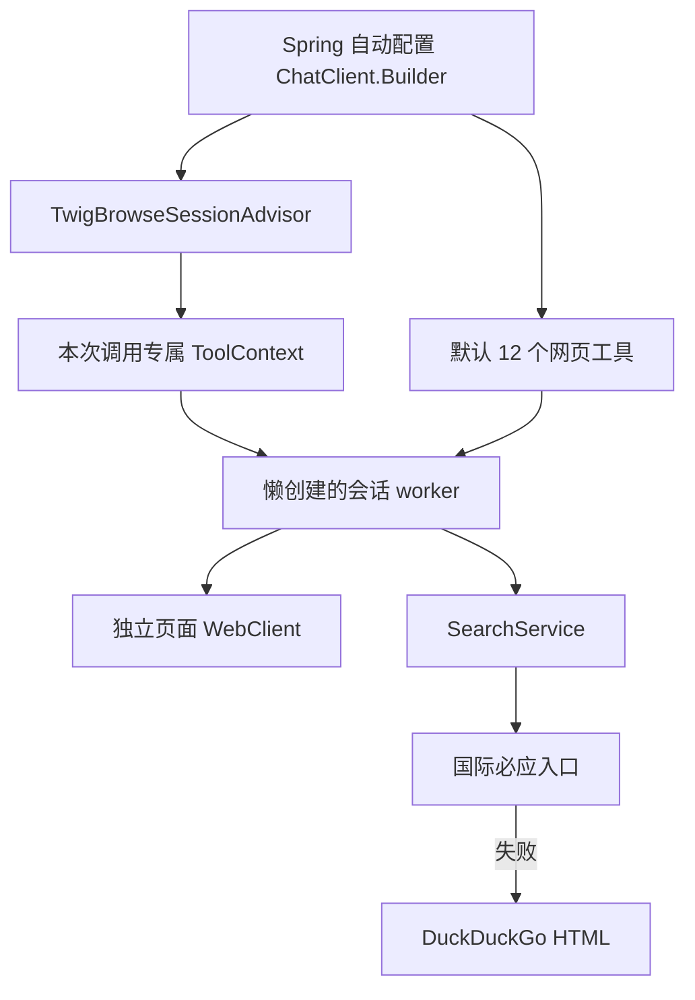

# TwigBrowse 架构

实现基线：Java 17、Spring Boot 4.1.1、Spring AI 2.0.1、HtmlUnit 5.5.0。

模块依赖：starter → autoconfigure → core。core 唯一直接运行依赖为 HtmlUnit；Spring 集成在 autoconfigure，不引入任何模型供应商 SDK 作为运行依赖。

## 请求边界

生命周期 Advisor 顺序位于 Spring AI 默认 ToolCallingAdvisor 之前，覆盖整个工具循环。同步通过 try-with-resources，流式通过 Flux.using 在完成、错误、取消时关闭会话。每个流订阅独立创建上下文。

会话引用存放于 ToolCallingChatOptions 的私有 ToolContext，不进入模型工具 schema。无需推断用户 ID，也不依赖 ThreadLocal。同一 ChatClient 可服务多个并发调用，每次调用单独管理页面、Cookie、存储和元素引用。业务聊天记忆和权限校验不属于此隔离层。

页面访问由每会话单独 worker 串行调度；HtmlUnit 本身仍可能有后台 JavaScript 任务。请求结束后排队操作取消、浏览器在 worker 上关闭，只有实际关闭后才归还并发配额。底层调用若无法中断，会保留配额直到清理结束，不把 Future.cancel 当作强制终止。

不提供跨轮持久会话。未来扩展必须用可信业务身份授权，不接受模型传入的用户身份作为隔离依据。

## 页面能力

页面 ID 和 ref 为随机不透明标识，查找只发生在当前会话。快照、DOM 查询和操作后重建 ref 集合；已导航或已从 DOM 移除的元素也拒绝操作。读取限长，返回来源和截断标志。

CSS 查询、属性读取、输入、点击、选择、勾选和有限等待组成 DOM 操作接口，不开放宿主任意 Java 对象或 eval。工具可以执行表单提交，调用方应保留自己的工具授权策略。

## 搜索和浏览器配置

搜索服务按配置顺序调用适配器；每次尝试独立浏览器且关闭 JS，避免搜索引擎脚本消耗和站点 Cookie 混用。当前不做并行竞速、跨用户查询缓存、全局熔断或多源合并。

BrowserProfile 为不可变部分覆盖对象，优先级：请求 ToolContext > 应用 browser 配置 > HtmlUnit 预设。应用传入的部分覆盖同时作用于导航与搜索。不会调用 BrowserVersion.setDefault，也不在请求之间修改共享预设。

## 自动装配约定

默认注册工具和 Advisor，`twigbrowse.enabled=false` 关闭。已有业务工具保留；重名由 Spring AI 的工具校验报错。模型需要支持 ToolCallingChatOptions，调用方保留 Spring AI 的正常工具循环；自定义 ToolCallingAdvisor 顺序时必须保持 TwigBrowse 生命周期 Advisor 在其外层。

手工静态 Builder 绕过自定义器是 Spring AI 的公开行为。使用自动配置 Builder 或 ChatClientBuilderConfigurer；首版不引入注解扫描和模型 Bean 替换。

限制与部署边界见 [安全说明](../SECURITY.md)。
